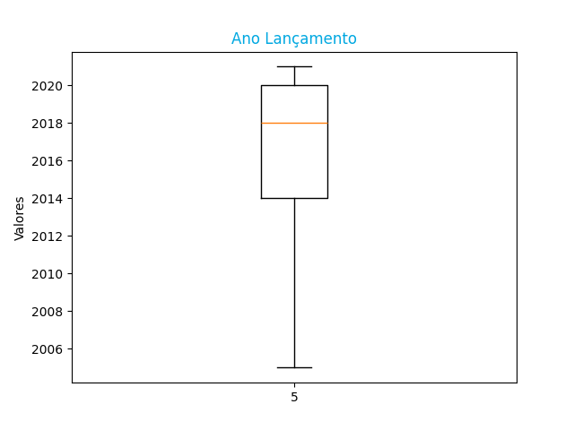
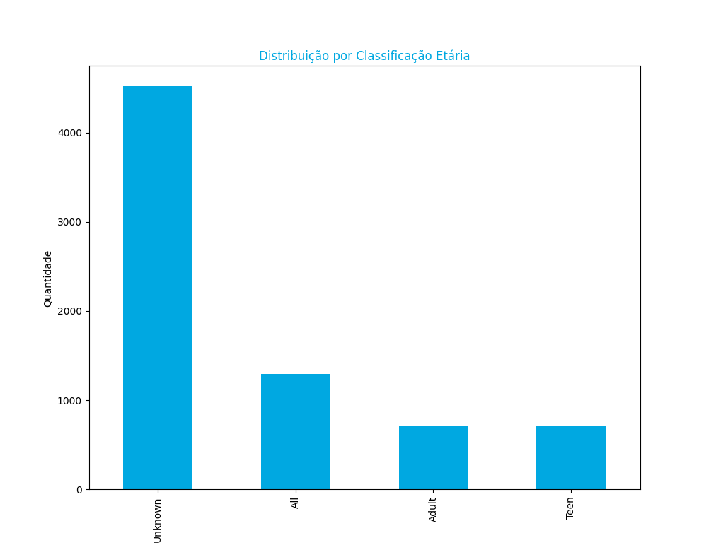
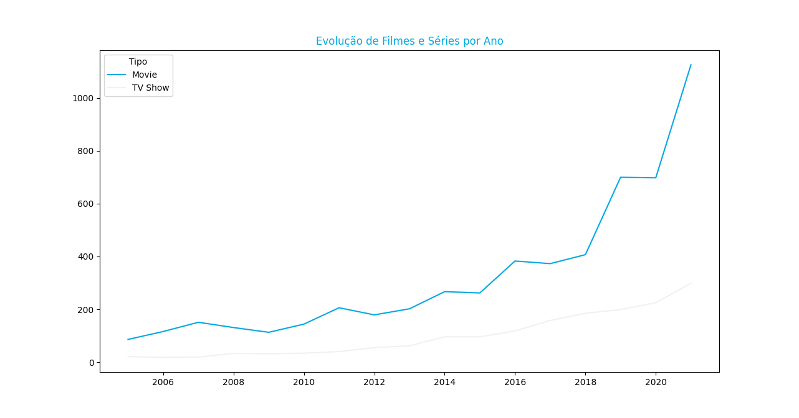
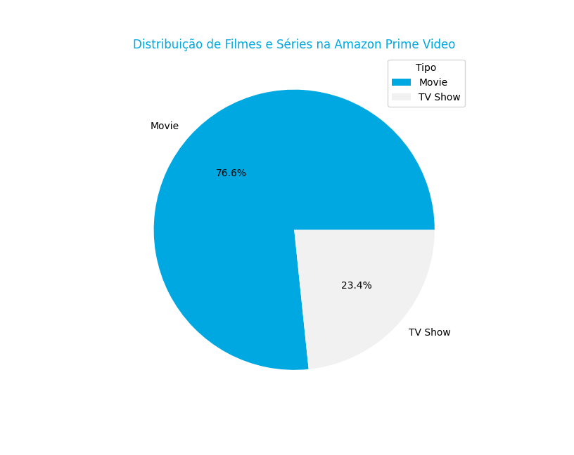
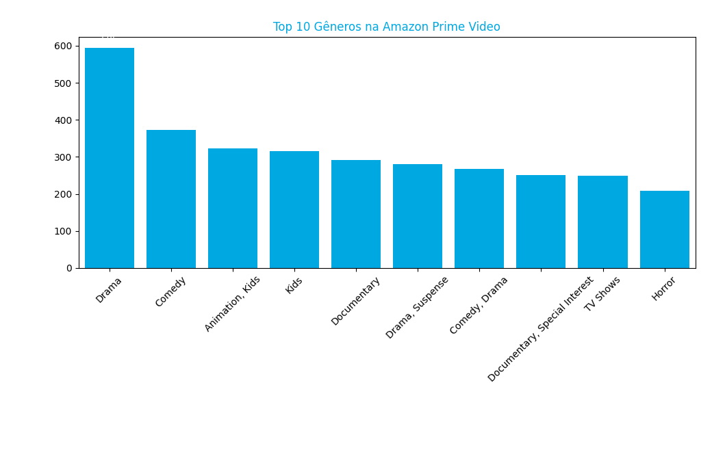

# Projeto de Análise de Dados em Python (AmazonPrime)

Este projeto tem como objetivo realizar a **análise completa de um conjunto de dados em formato CSV** contendo mais de **9.000 registros**, passando por todas as etapas do processo de **ETL (Extração, Transformação e Carga)** até a **preparação dos dados para aprendizado de máquina**

---

## Objetivos do Projeto

- Realizar a **extração e limpeza** dos dados brutos em CSV  
- Aplicar **transformações** para tratar valores ausentes e inconsistências  
- Executar **análises exploratórias** e **visualizações** para compreender o comportamento dos dados  
- Preparar o dataset para **modelos de Machine Learning**, aplicando normalização e divisão em treino e teste  
- Criar uma base sólida para experimentos com **modelos de classificação e regressão** 

---

## Tecnologias e Bibliotecas Utilizadas

- **Python 3**
- **Pandas** → Manipulação e tratamento de dados  
- **NumPy** → Operações matemáticas e vetoriais  
- **Matplotlib / Seaborn** → Visualização de dados  
- **Scikit-learn** → Preparação e modelagem de aprendizado de máquina  

---

## Etapas do Projeto

1. **Leitura e inspeção dos dados**
   - Importação do arquivo CSV e verificação de dimensões, tipos e valores nulos.

2. **Tratamento e transformação**
   - Padronização de colunas, remoção de duplicatas e tratamento de outliers.

3. **Análise exploratória (EDA)**
   - Estatísticas descritivas e visualizações gráficas (histogramas, correlações, boxplots).

4. **Preparação para Machine Learning**
   - Normalização dos dados, codificação de variáveis categóricas e split entre treino/teste.

5. **Aplicação de modelos**
   - Uso de algoritmos do **scikit-learn** (ex: Regressão Linear, Árvores de Decisão, KNN) para testes iniciais.

---

## Resultados e Conclusões

- O dataset foi limpo, transformado e preparado para uso em aprendizado de máquina.  
- As análises exploratórias revelaram padrões importantes e possíveis variáveis preditivas.  
- O pipeline ETL desenvolvido pode ser facilmente adaptado para outros conjuntos de dados.






---

## Como Executar o Projeto

1. Clone este repositório:
   ```bash
   git clone https://github.com/seu-usuario/nome-do-projeto.git
